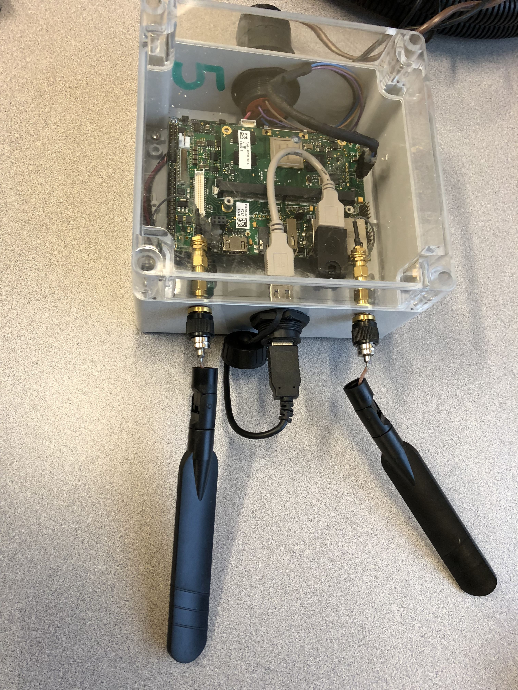

We have built 5 ISOBlue 2.0s and they are up and running when they need to.
Since we are not necessarily product design or mechanical design experts, we
try our best to fit ISOBlue inside a weatherproof enclosure with all the
connectors and antennas sticking out.

<!--truncate-->

Last Friday, we received one ISOBlue 2.0 back and it looked like this:

The antennas are both snapped off. Broken antennas mean no cellular connection
for ISOBlue 2.0.

A couple of things that we learned from this:
* The antenna connectors become loose over time.
* When the antenna connectors become loose, there is not way to adjust or
tighten them from the outside.
* There is no protection between the antenna and the antenna connector; it can
be easily snapped off if some heavy weights are accidently placed on the
antennas (which happens a lot during machine during normal machine operation).

We need to come up with a better design and here are some thoughts:
* More debug-friendly antenna connectors for antennas. If a machine operator
sees the antenna are loose, he or she could fix it without taking the lid off
of ISOBlue 2.0.
* More compact/flat antennas (similar to
[this one](http://www.taoglas.com/product/sentinel-ma251-adhesive-mount-2lte-mimo-antenna/))
rather than these long ones? Can we also place the antenna connectors inside
the enclosure?
